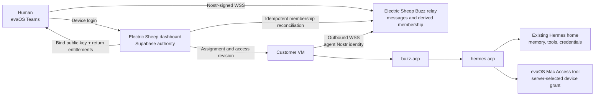
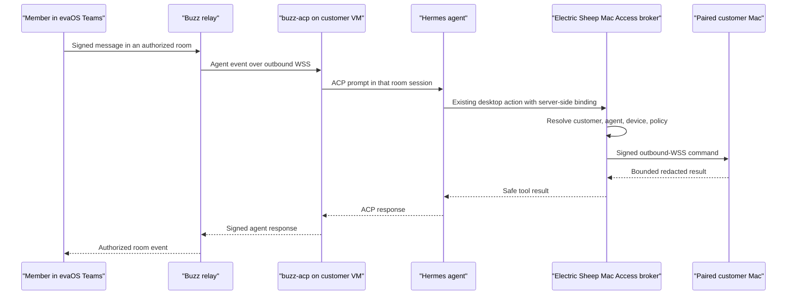
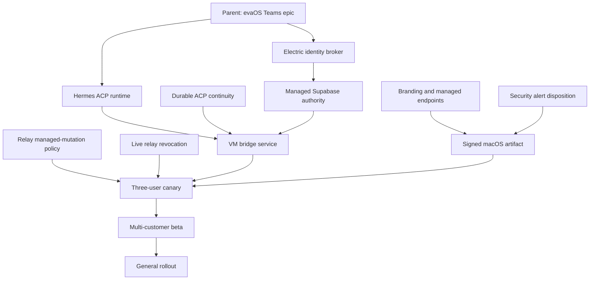

# evaOS Teams: Buzz + VM-hosted Hermes architecture

Status: implementation contract

Date: 2026-07-23

Working product name: **evaOS Teams**

First release line: **0.4.23-es.1**

Planning confidence: **approximately 95%**

This document is the implementation and handoff contract for an Electric Sheep
fork of Buzz. It turns Buzz into a branded team workspace where each customer
member can talk to the Hermes agent assigned to them in the Electric Sheep
dashboard. The Hermes agents, their credentials, tools, memory, connections, and
Mac Access capability continue to run on the customer's VM.

This contract is intentionally detailed enough for an implementation agent to
work issue-by-issue without inventing the product model. The remaining
uncertainty is isolated under [Owner gates and remaining 5%](#owner-gates-and-remaining-5).

## 1. Decision

Build **evaOS Teams** as a thin Electric Sheep fork of Buzz.

- Supabase and the Electric Sheep dashboard remain authoritative for customers,
  seats, roles, invitations, agent catalog entries, and member-to-agent
  assignments.
- Buzz provides the collaboration client, channels, direct messages, threads,
  message history, notifications, and relay protocol.
- Each existing OS-isolated Hermes agent runs a `buzz-acp` bridge on its VM and
  connects outbound to the Electric Sheep Buzz relay.
- A human signs into evaOS Teams with the existing Electric Sheep Desktop
  device-code flow. The backend maps that authenticated membership to one Buzz
  identity and one customer community.
- The app can show only communities, channels, members, and agent identities
  granted by the server.
- The app never receives a VM address, tailnet address, Hermes dashboard token,
  model credential, Mac Access pairing secret, relay signing key, or another
  member's agent binding.
- Mac Access remains a Hermes tool. A turn initiated in Buzz may invoke it only
  through the existing server-selected customer and device grant.
- Do not merge evaOS Teams into evaOS Agent or evaOS Mac Access. They remain
  separate apps with separate release and permission boundaries.
- Do not fork or modify Hermes core for the basic integration. Hermes already
  exposes an ACP server.

### User-visible result

For an account such as David Dorman's:

- David signs into evaOS Teams and can message Jane.
- Jackie signs into evaOS Teams and can message only her assigned agent.
- Reagan signs into evaOS Teams and can message only her assigned agent.
- A private assigned-agent room contains only the assigned member and agent.
- Shared team rooms contain only explicitly granted humans and agents.
- David manages seats, invitations, roles, and assignments in the Electric
  Sheep website, not inside Buzz.
- Removing a member or changing an assignment closes live access within 15
  seconds and denies the next request.

David's owner role does not silently grant transcript access to another
member's private assigned-agent room. An explicit policy and visible grant are
required for that access.

## 2. Proof boundary

The planning package may claim:

> The architecture, source seams, ownership boundaries, work packages, tests,
> rollout gates, and rollback path are specified for an implementation canary.

It may not claim:

- the fork is implemented;
- a relay is deployed;
- Hermes continuity through Buzz is proven;
- the app is signed, notarized, or customer-ready;
- shared multi-customer relay isolation is proven;
- mobile, fleet, or general rollout readiness;
- upstream acceptance of any proposed contribution.

The first customer claim is allowed only after the exact signed artifact, exact
relay release, exact VM services, and named canary scenarios all pass.

## 3. Exact source freeze

| Surface | Repository or source | Frozen identity |
|---|---|---|
| Buzz upstream mirror | `electricsheephq/buzz:main` | `06e3d82b04ab326a36694264ffb4b9dd94ec5661` |
| Buzz product base | `electricsheephq/buzz:electric/main` | upstream `v0.4.23`, commit `acfbb1bb6af54cb29cb152496ff43b8285dcb8cf` |
| Buzz upstream | `block/buzz` | Apache-2.0; default branch `main` |
| Dashboard | `electricsheephq/electric-sheep-website-dashboard-6158a244:main` | `daa40ef2e4b63d65c28b45a70edf2793309015ae` |
| Golden runtime | `electricsheephq/evaos-golden:main` | `be48af6cab5fb0edebff928b317892a6c33afeb6` |
| support-control | `electricsheephq/evaos-support-control:main` | `effdc1350ed671f31f2696b1a1bc340080e37262` |
| ws-proxy | `electricsheephq/evaos-ws-proxy:main` | `54c261a018f238d881513fd441d84f1c861e2768` |
| evaOS Agent Desktop | `electricsheephq/evaOS-hermes-desktop-app-adapter:main` | `ad0ddfb15d2a3589fac70162a181cfbfffe49d97` |
| Hermes stable runtime | `NousResearch/hermes-agent` | `v2026.7.20`, commit `3ef6bbd201263d354fd83ec55b3c306ded2eb72a` |
| Hermes upstream observation | `NousResearch/hermes-agent:main` | `fdd3943cb12dddc03ff321daee9e7fe73b84c40a` |

All implementation branches must record a fresh base before their first change.
The frozen identities above are planning inputs, not permission to build from a
stale head.

## 4. Reuse assessment

### Reuse without modification

- Buzz relay protocol, signed events, communities, members, channels, DMs,
  threads, search, files, notifications, and Tauri desktop.
- Buzz's existing external-account login pattern in
  `desktop/src-tauri/src/builderlab.rs`.
- Buzz's hosted-community client seam in
  `desktop/src/features/communities/hostedCommunityApi.ts`.
- Buzz's ACP bridge in `crates/buzz-acp`.
- Buzz's outbound agent configuration:
  `BUZZ_RELAY_URL`, `BUZZ_PRIVATE_KEY`, `BUZZ_ACP_AGENT_COMMAND`, and
  `BUZZ_ACP_AGENT_ARGS`.
- Hermes `hermes acp`, its normal home, model credentials, skills, tools,
  memory, and persistent session store.
- Electric Sheep Desktop device codes, opaque Desktop sessions, Keychain
  custody, customer accounts, memberships, invitations, agent catalog, and
  active binding tables.
- Existing per-agent Unix identities, homes, workspaces, and service templates.
- Existing Mac Access broker-selected binding and outbound-WSS design.

### Adapt in the Electric Sheep fork

- Replace Builderlab login and hosted-community ownership with the Electric
  Sheep identity and entitlement broker.
- Make Supabase the one-way business authority and hide conflicting native
  membership/invite/role controls in managed mode.
- Add product branding, package identity, managed endpoints, and an Electric
  Sheep-only release path.
- Disable all upstream update, support, and hosted-service calls in managed
  builds.
- Store the Electric Sheep Desktop session in the OS credential store.

### Small generic changes suitable for upstream

- Add Hermes as a first-class ACP runtime in Buzz's Rust runtime catalog.
- Persist `channel_id -> ACP session_id` and resume it after bridge restart.
- Disconnect a removed relay member's active sockets cluster-wide.
- Fix remote agent discovery and mentioning on secondary clients without
  requiring local runtime ownership.

### Do not build

- A new chat system.
- A second business identity or invitation system.
- A second agent assignment authority.
- A client-side VM or tailnet connector.
- A second Mac Access pairing or command relay.
- A customer-visible SSH path.
- A Hermes core fork for this integration.

## 5. First-principles check

### Desired function

An authenticated employee can collaborate with the VM-hosted Hermes agent or
team channels that their employer has explicitly granted, while the employer
manages seats and assignments in the Electric Sheep dashboard.

### Hard constraints

1. Supabase is the business identity and authorization authority.
2. Human and agent cryptographic identities are distinct.
3. Member-to-agent selection is server-controlled.
4. Tenant and channel membership are enforced at the relay.
5. VM, provider, relay, and Mac Access secrets never reach a human client.
6. Revocation affects existing connections as well as future requests.
7. The same isolated Hermes home and tools are used across evaOS Agent, Buzz,
   and other channels.
8. OpenClaw is not modified by this project.

### Soft assumptions rejected

- The chat client and the agent client do not need to be the same app.
- Buzz does not need to become the seat or assignment authority.
- A per-customer VM does not need to host its own relay.
- A human client does not need tailnet or VM details to message an agent.
- “Same agent” does not mean every surface shares one live transcript.

### Minimum coherent system

1. One Electric Sheep-managed Buzz relay and one canary community.
2. Electric Sheep device login plus Nostr public-key binding.
3. One `buzz-acp -> hermes acp` service per assigned Hermes agent.
4. Derived private room and team-channel grants.
5. A branded, managed desktop build.
6. Revocation and restart-continuity proof.

A custom replacement for Buzz would recreate channel, message, file, thread,
search, notification, mobile, desktop, release, and relay operations. The thin
fork is materially smaller and preserves a plausible upstream path.

## 6. System architecture



### Ownership map

| Concern | Authority | Projection or consumer |
|---|---|---|
| Customer, seats, roles, invitations | Supabase | Dashboard, evaOS Teams |
| Assignable agents | `customer_agent_instances` | Dashboard |
| Active member-to-agent assignment | `customer_agent_profile_bindings` | Broker, VM reconciler |
| Human Nostr public key | Supabase binding row | Buzz relay membership |
| Agent Nostr public key | Supabase agent identity row | Buzz relay membership |
| Community control public key | Supabase community row | Reconciler status |
| Community control private key | Electric Sheep secret manager | Reconciler only |
| Community and channel messages | Buzz relay | evaOS Teams, agent bridge |
| Derived community/channel access | Supabase revision + reconciler | Buzz relay |
| Human private key | macOS Keychain | evaOS Teams only |
| Agent private key | root/service-user-only VM secret | `buzz-acp` only |
| Hermes provider credential | isolated Hermes home | Hermes only |
| Mac Access device/pairing secret | existing broker and Mac Keychain | Existing Mac Access path only |

The Buzz relay is not allowed to grant a business seat, change an account role,
or create an authoritative agent assignment. The dashboard is not allowed to
read or rewrite message content as part of ordinary reconciliation.

### Community control identity

Each managed community has a distinct Electric Sheep control identity. Its
private key lives in Supabase Vault, following the dashboard's existing
`vault.decrypted_secrets` pattern; ordinary public tables store only the public
key and rotation metadata. A tightly scoped service-role reconciliation RPC may
retrieve the active secret into function memory long enough to sign the
existing Buzz community/channel membership operation. It never returns the
secret to an authenticated user or log.

This control identity is the relay `owner`. Customer humans, including the
Electric Sheep account owner, are relay `member` identities. Their business
role is displayed from Supabase and does not give their Nostr key a direct
relay-admin capability. This prevents a customer from bypassing the dashboard
with a hand-crafted native Buzz membership or role event.

The relay deployment also has a separate operator identity for community
create/archive operations. Its private key is a separately named Supabase Vault
secret. It is not used for ordinary room/member reconciliation and never
appears in a public table or app. Compromise, rotation, backup, and recovery of
the operator and community-control keys are separate runbook events.

## 7. Identity and login contracts

### 7.1 Human enrollment

1. The app starts the existing Electric Sheep Desktop device-code flow.
2. The user authenticates in the browser.
3. The backend verifies an active account membership and evaOS Teams
   entitlement.
4. The app generates a Nostr keypair or loads its existing keypair through
   Buzz's existing `SecretStore`/OS-keyring implementation.
5. The backend returns a single-use challenge bound to:
   - authenticated user;
   - membership;
   - customer account;
   - app session;
   - proposed public key;
   - nonce and expiry.
6. The app signs the challenge with the human private key.
7. The backend verifies the signature and records the public key against that
   active membership.
8. The backend returns only:
   - public relay URL;
   - community identifier or host;
   - member role as a display entitlement;
   - access revision;
   - expiry and refresh metadata.
9. The app connects directly to the relay and authenticates with its Nostr key.

The response must not contain agent IDs the user cannot access, VM identifiers,
tailnet addresses, backend ports, route credentials, Hermes tokens, or Mac
Access secrets.

The managed macOS build uses a distinct `evaos-teams-desktop` Keychain service
so it cannot collide with an installed upstream Buzz app. A missing or locked
Keychain enters visible recovery and fails closed; managed macOS does not
silently persist the identity key in a plaintext fallback file. An upstream
Buzz identity is not silently imported into the managed account.

### 7.2 Device replacement and key rotation

- A membership may have one active primary desktop identity in the initial
  canary.
- Registering a replacement requires a new authenticated Desktop session and
  visible confirmation.
- Rotation increments the access revision, removes the old public key from
  derived memberships, disconnects it, and then activates the new key.
- Lost-device recovery never exports the old private key from Keychain.
- Multi-device identity sync is deferred until an explicit encrypted recovery
  design exists.

### 7.3 Agent identity

- Each `customer_agent_instance` receives one distinct Nostr keypair.
- The private key is generated on the VM and written to a root-owned secret
  file, never Supabase, GitHub, logs, or evidence.
- Supabase stores only the public identity and rotation/attestation metadata.
- An agent identity cannot be shared by two customer accounts.
- Reassigning an agent inside the same account changes room membership; moving
  an agent between accounts rotates its Nostr key before admission to the new
  community.
- NIP-OA is not used as the canary's inbound authorization authority. In
  particular, the bridge does not set `BUZZ_AUTH_TAG` or
  `BUZZ_ACP_AGENT_OWNER`, because Buzz's owner/sibling shortcut would add an
  authority outside the derived channel and author allowlists. A future public
  agent attestation may be added only if it remains non-authoritative for
  prompting.

## 8. Minimal data model

Continue using:

- `customer_accounts`;
- `customer_account_memberships`;
- `customer_agent_instances`;
- `customer_agent_profile_bindings`;
- `desktop_app_device_codes`;
- `desktop_app_sessions`.

Add only the following control-plane projection tables.

### 8.1 `customer_buzz_communities`

| Column | Contract |
|---|---|
| `id` | UUID primary key |
| `customer_account_id` | unique foreign key |
| `community_id` | stable Buzz community identifier |
| `relay_host` | allowlisted public host, no embedded credential |
| `control_public_key` | public key for the per-community service owner |
| `control_key_epoch` | rotation generation; no secret reference returned |
| `status` | `provisioning`, `active`, `suspended`, `retired` |
| `access_revision` | monotonically increasing bigint |
| `metadata` | non-secret JSON only |
| timestamps | created/updated |

### 8.2 `customer_buzz_identities`

| Column | Contract |
|---|---|
| `id` | UUID primary key |
| `customer_account_membership_id` | foreign key; one active primary identity |
| `public_key` | canonical hex public key; unique while active |
| `npub` | derived display value |
| `status` | `pending`, `active`, `revoked`, `rotated` |
| `verified_at` | challenge verification time |
| `last_access_revision` | last reconciled revision |
| `device_metadata` | non-secret device label/version only |
| timestamps | created/updated/revoked |

### 8.3 `customer_buzz_agent_identities`

| Column | Contract |
|---|---|
| `id` | UUID primary key |
| `customer_agent_instance_id` | foreign key; one active identity |
| `public_key` | canonical hex public key |
| `npub` | derived display value |
| `status` | `pending`, `active`, `revoked`, `rotated` |
| `attestation_metadata` | public, non-secret attestation fields |
| `last_access_revision` | last reconciled revision |
| timestamps | created/updated/revoked |

### 8.4 `customer_buzz_access_outbox`

Use a transactional outbox so a Supabase authorization change and its
reconciliation request cannot diverge silently.

| Column | Contract |
|---|---|
| `id` | UUID primary key |
| `customer_account_id` | account scope |
| `access_revision` | monotonic account revision |
| `operation` | typed operation, not arbitrary SQL or event |
| `subject_id` | membership or agent instance |
| `desired_state` | non-secret normalized JSON |
| `status` | `pending`, `applied`, `failed`, `superseded` |
| `attempt_count` | bounded retries |
| `next_attempt_at` | retry schedule |
| `last_error_code` | bounded safe code, no raw upstream body |
| timestamps | creation, claimed, applied |

Every owner mutation that affects Buzz access increments
`customer_buzz_communities.access_revision` and inserts an outbox row in the
same database transaction.

### Outbox dispatch

Reuse the dashboard's existing Supabase `pg_net`, `pg_cron`, Edge Function, and
Vault pattern:

1. An outbox insert enqueues an asynchronous `pg_net` call to
   `buzz-access-reconcile`.
2. The Edge Function claims current rows through a service-role-only RPC using
   `FOR UPDATE SKIP LOCKED`.
3. It supersedes older revisions, loads the required Vault key through a narrow
   RPC, signs the relay mutation, and records only a safe result code.
4. A `pg_cron` recovery sweep runs at a maximum 10-second interval and retries
   eligible pending rows with bounded backoff.
5. If the deployed `pg_cron` version cannot accept second-granularity schedules,
   the canary stops until a small always-on worker performs the same claim RPC;
   a one-minute sweep cannot satisfy the revocation contract.

The immediate path and recovery sweep are both required. A browser callback is
not part of the correctness contract.

### RLS and RPC rules

- A member can read only their own active human identity and current
  entitlement summary.
- An `agent_only` member cannot list account agents, other identities, relay
  administration, or other members.
- Owners/admins may view status, not private keys or message content.
- Only service-role reconciliation may write community and agent identity
  projection rows after provisioning.
- Public-key challenge verification is a security-definer RPC with strict
  authenticated membership checks and replay expiry.
- Arbitrary community IDs, public keys for another member, or client-supplied
  agent IDs are rejected.

## 9. Derived room policy

The reconciler computes desired Buzz state from Supabase truth.

### Private assigned-agent room

For each active member binding:

- create or retain one private room;
- include the member's active public key;
- include the assigned agent's active public key;
- exclude all other people and agents;
- use a stable opaque room identity;
- do not put a raw customer ID, email, VM ID, or agent credential in the room
  name or metadata.

Unassigning the agent removes both the derived room grant and the ability to
start a new agent turn. Historical-message retention follows the account policy;
current access does not survive unassignment.

### Shared team rooms

- Created by an authorized account owner/admin through the Electric Sheep
  control plane in the first managed release.
- Human and agent membership is explicit.
- Assignment to a private agent does not automatically grant that agent to all
  team rooms.
- Buzz-native room membership controls may be visible only when they call the
  Electric Sheep authority or are marked read-only in managed mode.

### Relay-enforced managed collaboration policy

UI hiding is not an authorization boundary. Upstream Buzz permits an ordinary
private-channel member to invite another member. That would let a customer sign
a native event to add someone to an assigned-agent room and read its history.

Add a relay-enforced community policy with two values:

- `native`: preserve upstream Buzz behavior;
- `control_plane`: only the Electric Sheep community control identity may
  create/archive/delete managed channels, change visibility, or add/remove/change
  channel and DM membership.

Milestone 1 uses `control_plane` for the entire dedicated canary community.
Human and agent members may send permitted messages, reactions, edits, and
threads only inside rooms already granted to them. Customer-signed attempts to
create a room, invite a member, add an agent, change a role, or change visibility
fail at the relay even if a modified upstream client submits the event.

The policy is stored and resolved server-side. A client tag or event cannot
downgrade it. Upstream/default communities remain `native`.

### Role mapping

| Electric Sheep role | Managed Buzz transport role | Product authority |
|---|---|---|
| `owner` | member | full account controls in the Electric Sheep dashboard |
| `admin` | member | delegated account controls allowed by Supabase |
| `employee` | member | rooms explicitly granted by Supabase |
| `agent_only` | member | assigned-agent and explicitly granted rooms only |

This mapping is a projection. Changing a Buzz role does not change the Electric
Sheep role. The Electric Sheep control identity is the sole relay owner in
managed mode.

## 10. Agent bridge on the VM

### 10.1 Process topology

Run one bridge per isolated agent:

```text
evaos-buzz-agent@<agent>.service
  -> buzz-acp
     -> hermes acp
        -> existing HERMES_HOME, workspace, credentials, skills, tools, memory
```

Required environment:

```text
BUZZ_RELAY_URL=wss://<managed-relay-host>
BUZZ_ACP_AGENT_COMMAND=hermes
BUZZ_ACP_AGENT_ARGS=acp
BUZZ_ACP_CHANNELS=<derived comma-separated approved channel UUIDs>
BUZZ_ACP_RESPOND_TO=allowlist
BUZZ_ACP_RESPOND_TO_ALLOWLIST=<derived approved human public keys>
BUZZ_ACP_ALLOWED_RESPOND_TO=allowlist
BUZZ_ACP_NO_MEMORY=true
BUZZ_ACP_PERMISSION_MODE=default
BUZZ_ACP_MULTIPLE_EVENT_HANDLING=queue
BUZZ_ACP_AGENTS=1
HERMES_HOME=/var/lib/evaos/hermes/<agent>
```

`BUZZ_PRIVATE_KEY` must be injected from a systemd credential through a small
root-owned launcher that reads the credential, exports it only to the service
process, and `exec`s `buzz-acp`. It is not placed on the command line, committed
to an environment file, or written to the runtime manifest.

### 10.2 Service rules

- Run as the existing `hermes-<agent>` Unix user.
- Use the existing Hermes home and workspace; do not copy credentials.
- Atomically generate the channel and author allowlists from the current access
  revision. The bridge must satisfy both checks before starting a turn.
- Leave `BUZZ_AUTH_TAG` and `BUZZ_ACP_AGENT_OWNER` unset in the canary so the
  built-in owner/sibling shortcut cannot bypass the derived allowlists.
- An unauthorized member adding the agent identity to a new DM or channel does
  not make that channel eligible; it is absent from `BUZZ_ACP_CHANNELS`.
- For the canary, an access revision atomically replaces the allowlist config
  and restarts only that agent bridge. General beta may add a safe live reload.
- Disable Buzz's NIP-AE memory injection. Hermes remains the only agent-memory,
  persona, provider, model, permission, skill, and tool authority.
- Do not set `BUZZ_ACP_MODEL`, provider overrides, team-persona instructions, or
  permission bypass. The bridge adds only the minimum transport context needed
  to reply in Buzz.
- Use one ACP worker and queued messages for the canary so a second chat message
  cannot silently cancel an in-flight Hermes turn.
- Network egress is limited to the public Buzz relay and existing approved tool
  endpoints.
- No inbound customer port is opened.
- The service is independently startable/stoppable from the Hermes gateway.
- OpenClaw services and files are untouched.
- Logs include account-safe correlation IDs, agent instance ID, room ID hash,
  result class, and duration; never prompts, message bodies, keys, tokens, URLs
  with credentials, or tool results.

### 10.3 Conversation continuity

Buzz currently keeps `channel_id -> ACP session_id` only in the running
`SessionState.sessions` map in `crates/buzz-acp/src/pool.rs`. Agent exit calls
`invalidate_all()`, so a bridge restart loses the mapping even when the ACP
runtime supports durable sessions.

Before customer readiness:

1. Persist the mapping in a per-agent state file or database with atomic writes.
2. Namespace it by relay/community, agent public key, channel ID, and ACP runtime
   identity.
3. On startup, load the mapping.
4. Ask Hermes ACP to load or resume the stored session.
5. If the session is missing or incompatible, create a new session and
   atomically replace only that channel's mapping.
6. Never resume a session across agent identities, customer accounts, or
   channels.
7. Cover process crash, corrupt map, deleted Hermes session, runtime upgrade,
   key rotation, and explicit new-conversation behavior.

For an internal canary only, a restart may create a new transcript session if
the UI clearly states that limitation. General rollout requires durable resume.

## 11. First-class Hermes runtime in Buzz

Add Hermes to the Rust `KNOWN_ACP_RUNTIMES` catalog in
`desktop/src-tauri/src/managed_agents/discovery.rs`; do not add a separate
TypeScript-only runtime table.

Required metadata:

- ID: `hermes`
- Label: `Hermes Agent`
- commands: `hermes`, `hermes-acp`
- underlying CLI: `hermes`
- command-specific launch:
  - `hermes` uses argument `acp`;
  - `hermes-acp` uses no duplicated `acp` argument.
- readiness/auth probe: `hermes acp --check`
- optional guided setup: `hermes acp --setup`, only after explicit user action
- skill directory and configuration metadata must match current Hermes
  documentation and source.

The generic upstream change must not mention Electric Sheep, Supabase, evaOS,
customer VMs, or managed-mode policy.

## 12. Mac Access behavior

Buzz is another message origin, not another computer-control system.



The VM sends action arguments only. It never holds the Mac relay credential,
command-signing key, pairing code, device secret, or a client-selected binding.
Existing Off, emergency stop, revoke, and server-selected binding semantics
remain authoritative.

## 13. Revocation contract

Membership removal, role loss, identity rotation, or assignment revocation must
execute this ordered, idempotent workflow:

1. Commit the Supabase authority change.
2. Increment the account's access revision and write the outbox item in the
   same transaction.
3. Reconciler removes the human or agent public key from affected community and
   channel membership.
4. Reconciler atomically replaces affected agent channel/author allowlists and
   restarts only those bridge services for the canary.
5. Relay invalidates membership/channel caches.
6. Relay closes that public key's active sockets on every pod.
7. Agent bridge cancels or ignores turns whose authorization revision is stale.
8. The next authentication, read, write, mention, and tool request fail closed.

Target: active access closes in at most 15 seconds.

Buzz's current `RELAY_ADMIN_REMOVE_MEMBER` path removes the database membership
and publishes membership events, but it does not call the existing
`disconnect_pubkey_clusterwide` path. Add that call and cluster tests. A durable
membership check remains the fallback if pub/sub delivery is lost.

Reassignment inside an account:

- revoke the old private-room grant;
- disconnect the old member if necessary;
- cancel pending agent turns from that member;
- grant the new member only after the old revision is no longer active.

Moving an agent between accounts additionally rotates the agent Nostr key.

## 14. Relay deployment

### Internal canary

- One dedicated staging relay deployment.
- One canary community.
- Separate Postgres, Redis, object-storage prefix, signing key, and backup
  identity from upstream/public Buzz.
- Host-derived community binding.
- TLS/WSS only.
- No public self-registration.
- No Builderlab dependency.
- NIP-42/NIP-98 signed requests and relay membership are the client/agent auth
  path; do not introduce a second bearer-token authority for ordinary messaging.

### Guarded beta

A shared multi-customer relay is allowed only after:

- the draft multi-tenant model is implemented and its conformance suite passes;
- every tenant-scoped table and projection carries community scope;
- host-to-community resolution fails closed;
- cross-community read/write/search/file/profile/DM/agent tests pass;
- cluster revocation passes;
- backup/restore for one community is proven;
- rate, storage, retention, and abuse limits are enforced per community;
- sanitized error and log surfaces are reviewed.

Until then, use a dedicated relay deployment per canary cohort or customer. Do
not describe the current draft specification as runtime isolation proof.

## 15. Managed desktop product contract

### Identity

- Product/executable: `evaOS Teams`
- Base: Buzz `v0.4.23`
- Version: `0.4.23-es.1`
- Bundle ID: `com.electricsheephq.evaos.teams`
- Protocol: `evaos-teams://`
- Installed path: `/Applications/evaOS Teams.app`
- Artifact: `evaOS-Teams-0.4.23-es.1-arm64.dmg`
- Channel: `managed-beta`
- Updater: disabled for the first canary

The working product name is an owner gate before public release. Internal
identifiers should not be mechanically renamed unless they are user-visible or
part of the package identity.

### Branding and endpoint audit

Replace visible Buzz, Builderlab, and Block product branding in:

- app, installer, dock, window, menu, About, protocol metadata;
- login, onboarding, community selection, empty states, notifications;
- update, error, recovery, settings, diagnostics, and support copy;
- dashboard download and onboarding.

Legal/About must retain Apache-2.0 notices and may state:

> Built from Buzz by Block, used under the Apache License 2.0.

Managed builds must not contact:

- the upstream GitHub release/update feed;
- Builderlab account or hosted-community endpoints;
- upstream Buzz support, push, telemetry, or service endpoints unless an owner
  explicitly approves and documents one.

Add a test that fails if managed login, launch, update, or recovery causes an
upstream host access, Git process spawn, or upstream repository request.

### Native controls in managed mode

Hide or make read-only any control that could conflict with Supabase authority:

- community creation/archive/transfer;
- member invite/remove/role mutation;
- agent ownership or authorization changes;
- relay selection outside the returned allowlist;
- arbitrary local agent installation for business members.

Generic personal Buzz mode may retain upstream behavior on upstream builds.

## 16. Fork and contribution strategy

### Electric Sheep fork

- `main`: fast-forward mirror of `block/buzz:main`.
- `electric/main`: reviewed Electric Sheep patch stack over a pinned stable Buzz
  release.
- `feature/<issue>-<slug>`: one issue and one repository surface.
- `release/evaos-teams-<version>`: exact signed candidate.

Electric-only patches:

- Electric Sheep login and entitlement broker;
- managed-mode authority rules;
- branding/package identity;
- endpoint/updater/distribution policy;
- Electric Sheep release automation.

### Upstream contributions

Create each generic change from a fresh upstream `main`, with an upstream issue
when required:

1. Hermes runtime metadata and readiness.
2. Durable channel-to-ACP session resume.
3. Cluster-wide disconnect on member removal.
4. Remote agent discovery/mentioning independent of local ownership.

Do not mix Electric Sheep branding or Supabase logic into upstream PRs.

### Sync policy

- Automated daily upstream fetch and comparison.
- Weekly reviewed product-base update during beta.
- Record upstream tag, upstream commit, patch-stack commits, CI, and release
  artifact in every release.
- Never allow the managed app to update directly from the upstream feed.
- Security updates may fast-track, but still require exact-head CI and signed
  artifact proof.

## 17. Known upstream risks and mandatory dispositions

Track rather than silently inherit:

- remote agents hidden or unmentionable on secondary clients:
  `block/buzz#2349` and `block/buzz#2508`;
- agent allowlist/respond-to edits not persisting: `block/buzz#2501`;
- mobile invite retry no-op: `block/buzz#1979`;
- mobile nested thread visibility: `block/buzz#2415`;
- mobile rollout documentation gap: `block/buzz#2324`;
- agent profile republish dropping fields: `block/buzz#2534`;
- hosted-login TLS recovery: `block/buzz#2484`;
- created community stuck on Join: `block/buzz#2367`;
- ten inherited dependency alerts at fork time, including two high-severity
  alerts.

Only supported canary paths block the first milestone. Every relevant finding
receives one terminal disposition: fixed now, accepted follow-up, accepted
tradeoff, false/not applicable, or escalated.

## 18. Roadmap and issue dependency graph

Parent tracker:
[`electricsheephq/buzz#1`](https://github.com/electricsheephq/buzz/issues/1).
The dependency order remains normative if issues are split during
implementation.



### Milestone 1: evaOS Teams 0.4.23-es.1 — Internal Canary

Milestone:
[`electricsheephq/buzz milestone 1`](https://github.com/electricsheephq/buzz/milestone/1).

Issues:

- [`buzz#2`](https://github.com/electricsheephq/buzz/issues/2) — first-class
  Hermes ACP runtime.
- [`buzz#3`](https://github.com/electricsheephq/buzz/issues/3) — durable
  channel-to-ACP continuity.
- [`dashboard#703`](https://github.com/electricsheephq/electric-sheep-website-dashboard-6158a244/issues/703)
  — identity, community, and derived-access broker.
- [`buzz#4`](https://github.com/electricsheephq/buzz/issues/4) — managed Electric
  Sheep login.
- [`buzz#5`](https://github.com/electricsheephq/buzz/issues/5) — one-way
  Supabase authority.
- [`buzz#6`](https://github.com/electricsheephq/buzz/issues/6) — cluster-wide
  live revocation.
- [`buzz#15`](https://github.com/electricsheephq/buzz/issues/15) —
  relay-enforced control-plane authority for managed channel/DM mutations.
- [`Golden#263`](https://github.com/electricsheephq/evaos-golden/issues/263) —
  per-agent VM bridge.
- [`buzz#7`](https://github.com/electricsheephq/buzz/issues/7) — remote agent
  discovery/mentioning.
- [`buzz#8`](https://github.com/electricsheephq/buzz/issues/8) — branding and
  managed endpoints.
- [`buzz#9`](https://github.com/electricsheephq/buzz/issues/9) — dependency
  security dispositions.
- [`buzz#14`](https://github.com/electricsheephq/buzz/issues/14) — control/operator
  keys, Keychain, VM credentials, logs, renderer storage, deep links, endpoint
  allowlists, and transcript handling.
- [`buzz#10`](https://github.com/electricsheephq/buzz/issues/10) — signed
  internal macOS artifact.
- [`support-control#386`](https://github.com/electricsheephq/evaos-support-control/issues/386)
  — three-user installed canary and rollback.

Exit only when:

- one canary account and community are provisioned;
- three members authenticate separately;
- three assigned VM-hosted Hermes agents connect outbound;
- each member can use only their assigned private room;
- one explicit shared room works;
- Hermes tools, including an allowed Mac Access read action, work from Buzz;
- active revocation completes within 15 seconds;
- agent bridge restart preserves or explicitly handles conversation continuity;
- exact arm64 app is signed, notarized, stapled, installed, and tested;
- rollback succeeds without touching OpenClaw.

### Milestone 2: evaOS Teams 0.4.x-es — Guarded Business Beta

Milestone:
[`electricsheephq/buzz milestone 2`](https://github.com/electricsheephq/buzz/milestone/2).

Issues:

- [`buzz#11`](https://github.com/electricsheephq/buzz/issues/11) — upstream sync
  and thin patch-stack reporting.
- [`buzz#12`](https://github.com/electricsheephq/buzz/issues/12) —
  multi-customer relay isolation and operations.

- multi-customer isolation conformance;
- backup/restore;
- observability and bounded retention;
- universal macOS artifact and supported upgrade path;
- remote-agent client correctness;
- selected customer rollout;
- incident and rollback runbooks.

### Milestone 3: evaOS Teams 1.0 — General Rollout

Milestone:
[`electricsheephq/buzz milestone 3`](https://github.com/electricsheephq/buzz/milestone/3).

Issue:
[`buzz#13`](https://github.com/electricsheephq/buzz/issues/13).

- stable fork-sync cadence;
- managed updater;
- mobile decision and supported platforms;
- per-tenant quotas, billing signals, abuse controls, and retention;
- recovery and support tooling;
- fleet rollout evidence;
- customer documentation and adoption proof.

## 19. Implementation work packets

Each packet must be implemented on a fresh branch, with the named dependency,
tests, stop condition, and evidence. An agent must not silently absorb the next
packet.

### WP1 — Hermes ACP runtime metadata

- Repository: `electricsheephq/buzz`
- Base: fresh upstream `main`
- Primary files:
  - `desktop/src-tauri/src/managed_agents/discovery.rs`
  - `desktop/src-tauri/src/managed_agents/discovery/runtime_metadata.rs`
  - focused discovery/readiness tests
- Change: add Hermes command discovery, correct command-specific ACP args, and
  readiness/auth probe.
- Tests: runtime catalog, binary discovery, command construction, readiness
  success/failure.
- Stop: Hermes CLI contract differs from the frozen stable source or requires
  Electric Sheep-specific behavior.
- Deliverable: upstreamable PR.

### WP2 — Durable Buzz-to-ACP session continuity

- Repository: `electricsheephq/buzz`
- Base: fresh upstream `main`
- Primary files: `crates/buzz-acp/src/pool.rs` plus a small persistence module.
- Change: persist scoped channel/session mappings and load/resume on restart.
- Tests: clean restart, crash, corrupt state, missing ACP session, channel
  isolation, agent identity change, runtime change, explicit reset.
- Stop: ACP runtime lacks a safe load/resume contract; escalate a canary-only
  new-session policy rather than inventing cross-session replay.
- Deliverable: upstreamable PR.

### WP3 — Electric Sheep identity and community broker

- Repository: dashboard
- Base: fresh `main`
- Dependencies: existing Desktop device-session and agent assignment contracts.
- Change: tables/RLS/RPCs/outbox described in this document; public-key
  challenge binding; entitlement response; community provisioning and
  reconciliation worker.
- Tests: replay, expiry, wrong user, wrong account, inactive member,
  `agent_only`, key rotation, arbitrary agent/community rejection, outbox
  idempotency.
- Stop: implementation would create a second seat/role/assignment authority or
  expose a secret to Supabase/client.

### WP4 — Managed evaOS Teams client mode

- Repository: `electricsheephq/buzz`
- Base: `electric/main`
- Dependency: WP3 contract.
- Change: Electric login, reuse of Buzz `SecretStore` under a distinct managed
  Keychain service, fail-closed managed macOS recovery, returned relay
  allowlist, managed feature gates, and one-way authority UI.
- Tests: login, refresh, logout, relaunch, lost session, second user, key
  rotation, forbidden native controls, relay override denial.
- Stop: private keys or VM details would transit the dashboard.

### WP5 — Relay-enforced managed collaboration policy

- Repository: `electricsheephq/buzz`
- Base: fresh upstream `main` if maintainers accept the generic policy;
  otherwise `electric/main`.
- Primary files: community settings/model, relay channel/DM command
  authorization, and conformance tests.
- Change: add `native | control_plane`; in `control_plane`, require the
  community control identity for channel/DM creation, membership, role,
  visibility, archive, and delete mutations.
- Tests: hand-crafted signed bypass events for every mutation; default-native
  compatibility; wrong community; control-key rotation.
- Stop: a customer member or agent key can change who reads a managed room.

### WP6 — Live member disconnect

- Repository: `electricsheephq/buzz`
- Base: fresh upstream `main`
- Primary files:
  - `crates/buzz-relay/src/handlers/relay_admin.rs`
  - `crates/buzz-relay/src/state.rs`
  - cluster relay tests
- Change: removal invokes community-scoped cluster disconnect and durable
  re-auth remains fail-closed.
- Tests: same pod, other pod, lost pub/sub, wrong community, reconnect.
- Stop: disconnect can cross a community boundary.
- Deliverable: upstreamable PR.

### WP7 — VM per-agent Buzz bridge

- Repository: Golden
- Dependency: WP1, WP2, WP3 entitlement/identity contract.
- Change: provision `evaos-buzz-agent@.service`, VM secret generation, agent
  public-key registration, derived channel/author allowlists, health, disable,
  rollback, and no-OpenClaw mode.
- Tests: dry-run, idempotency, separate UIDs/homes/keys, outbound-only network,
  unauthorized-DM rejection, stale-revision rejection, restart continuity,
  systemd-credential injection, no duplicate memory/model/permission authority,
  secret redaction, OpenClaw before/after comparison.
- Stop: service requires copied model credentials, inbound customer port, or
  OpenClaw write/restart.

### WP8 — Branding, managed endpoints, and packaging

- Repository: `electricsheephq/buzz`
- Base: `electric/main`
- Dependency: WP4.
- Change: package identity and visible branding; remove managed upstream
  endpoints; managed updater disabled; Apache notices retained.
- Tests: forbidden brand/host scan, network-spy launch/login/update/recovery,
  package metadata, icons, protocol, About/legal.
- Stop: managed build can contact or apply upstream updates.

### WP9 — Remote agent discovery

- Repository: `electricsheephq/buzz`
- Base: fresh upstream `main`
- Links: upstream `#2349`, `#2508`.
- Change: render/mention authorized remote agents based on relay state rather
  than local runtime ownership.
- Tests: primary and secondary client, private room, shared room, unauthorized
  agent hidden, stale profile.
- Stop: fix weakens authorization or enumerates agents outside room/community.

### WP10 — Signed internal artifact

- Repository: `electricsheephq/buzz`
- Base: exact integrated release head.
- Dependency: WP4, WP7, security disposition.
- Change: arm64 Developer ID signing, notarization, stapling, DMG, immutable
  checksum, private dashboard allowlist.
- Tests: unpacked functional smoke before signing; mount/install; `codesign`,
  `spctl`, notarization/stapling; cold/relaunch/logout/second-user.
- Stop: unsigned/unnotarized artifact, wrong identity, upstream updater access,
  or secret in build output.

### WP11 — Three-user installed canary

- Repositories: support-control tracker plus exact releases.
- Dependency: all Milestone 1 blockers.
- Change: no source feature work; execute the named matrix and rollback.
- Tests: see [Acceptance matrix](#20-acceptance-matrix).
- Stop: cross-access, stale access beyond 15 seconds, continuity corruption,
  OpenClaw change, secret leak, or unsupported customer artifact.

## 20. Acceptance matrix

| Area | Required proof |
|---|---|
| Human auth | Three separate users complete device login; sessions survive relaunch and logout revokes locally and remotely. |
| Key custody | Human private keys remain in Keychain; agent private keys remain on their VM service; no key appears in Supabase, logs, issues, or evidence. |
| Assignment | Each member reaches only the server-assigned Hermes agent; arbitrary agent/community/relay input fails. |
| Private rooms | Three private rooms contain exactly one assigned member and one assigned agent. |
| Shared room | Explicitly granted humans and agents can collaborate; an ungranted identity cannot discover or enter it. |
| Native bypass | Hand-crafted channel/DM creation, invite, membership, role, visibility, archive, and delete events from customer keys fail in `control_plane` mode. |
| Bridge gate | A community member who creates a new DM or adds the agent to an unapproved channel cannot trigger an agent turn. |
| Hermes continuity | Same isolated Hermes home, memory, credentials, skills, and tools are used; bridge restart resumes the correct room session or follows the explicitly accepted canary limitation. |
| Hermes authority | Buzz does not override model/provider/permissions or inject a second memory/persona system; Hermes remains authoritative. |
| Cross-surface semantics | Buzz uses a distinct ACP room session; it does not claim to share the live evaOS Agent or Telegram transcript. |
| Revocation | Remove, unassign, role loss, and key rotation close active access within 15 seconds and deny reconnect. |
| Relay isolation | No cross-community reads, writes, profiles, DMs, search, files, errors, or agent enumeration. |
| Mac Access | One allowed read and one allowed action use the existing server-selected grant; Off, emergency stop, wrong binding, and revoke fail closed. |
| VM isolation | Distinct Unix user, Hermes home, workspace, agent key, process, and logs per agent; no inbound customer port. |
| OpenClaw | No write below `.openclaw`; no OpenClaw restart or identity change. |
| Managed client | Native business-authority conflicts are hidden/read-only; no upstream updater/Builderlab endpoint is contacted. |
| Artifact | Exact source head, version, bundle ID, signature, notarization, staple, checksum, install path, and Gatekeeper result recorded. |
| Recovery | Relay restore, agent bridge restart, identity rotation, feature disable, service stop, and client withdrawal are exercised. |

## 21. Evaluation contract

- Eval required: yes
- Planning claim class: advisory
- Runtime claim class after all gates: named-customer canary
- Eval name/version: `evaOS Teams Buzz + Hermes Canary / v1`
- Required suites:
  - `evaos-teams-auth-binding-v1`
  - `buzz-hermes-acp-continuity-v1`
  - `evaos-teams-tenant-isolation-v1`
  - `evaos-teams-revocation-v1`
  - `evaos-teams-installed-macos-v1`
  - `evaos-teams-backup-restore-v1`
  - `evaos-teams-mac-access-routing-v1`
- Thresholds:
  - 100% of required scenarios;
  - zero cross-account or cross-agent access;
  - active revocation at or below 15 seconds;
  - correct session after bridge restart;
  - zero secrets in logs/evidence;
  - exact signed installed artifact;
  - successful scoped restore.
- Runner:
  - focused local tests for development;
  - repository GitHub Actions on exact pushed heads;
  - relay integration environment for cluster/tenant proof;
  - support-control canonical target resolution for VM canary;
  - installed-app smoke on the named Mac artifact.
- Evidence root:
  `/Volumes/LEXAR/Codex/evidence/evaos-teams/<release>-<canary>/`
- Proof boundary:
  passing the first suite proves only the named account, community, VM agents,
  relay release, and signed macOS artifact. It does not prove fleet, public,
  mobile, or general release readiness.

## 22. Rollback

Rollback is ordered and must be executable without OpenClaw changes:

1. Hide/withdraw the dashboard download.
2. Disable the account's evaOS Teams feature flag.
3. Revoke Desktop sessions and increment access revision.
4. Remove human and agent identities from affected relay memberships and
   disconnect active sockets.
5. Stop only `evaos-buzz-agent@*.service`.
6. Leave Hermes services, homes, credentials, and evaOS Agent access intact.
7. Restore the previous relay release or dedicated canary snapshot if needed.
8. Verify OpenClaw service identity and files are unchanged.
9. Preserve only redacted evidence.

Rollback does not delete message history by default. Retention/deletion is a
separate authorized operation.

## 23. Stop conditions

Stop the affected lane if:

- Supabase is no longer the one authority for seats, roles, or assignment;
- a client can submit or infer an unauthorized agent identity;
- a private key, provider credential, VM/tailnet route, raw token, pairing code,
  or customer message appears in Git, logs, issues, or evidence;
- member removal leaves an active socket usable beyond 15 seconds;
- session resume can cross a room, agent, or account;
- shared-relay isolation is inferred from the draft spec rather than proven;
- the managed client contacts the upstream updater or Builderlab;
- a VM change writes to or restarts OpenClaw;
- Mac Access bypasses its existing server-selected binding;
- the artifact is unsigned, unnotarized, unstapled, or has the wrong identity;
- a realistic supported-path P0/P1 or gate-relevant P2 remains unresolved.

## 24. Owner gates and remaining 5%

These decisions are deliberately not guessed:

1. Confirm **evaOS Teams** as the final public product name.
2. Choose the first real canary account after Benjamin's internal employee test.
3. Decide whether the canary accepts a new ACP session after bridge restart or
   blocks until durable resume lands. Recommendation: durable resume blocks
   customer distribution, but not an internal engineering canary.
4. Choose dedicated-per-customer versus dedicated-cohort relay for the guarded
   beta. Recommendation: dedicated cohort until multi-tenant conformance passes.
5. Define transcript retention and whether account owners can request access to
   another member's private assigned-agent room. Recommendation: no implicit
   owner transcript access.
6. Decide whether upstream Buzz mobile is in the first public release.
   Recommendation: desktop-only until the listed mobile defects are resolved.
7. Confirm the commercial and trademark review for the product name and
   upstream attribution before public distribution.
8. Approve message-content retention, encryption-at-rest, access, export, and
   deletion policy before any real customer rollout. Do not describe ordinary
   team-channel storage as end-to-end encrypted without protocol proof.

These gates account for the remaining uncertainty. None changes the core
authority, identity, VM, relay, or Mac Access architecture.

## 25. Durable successor contract

- Goal: deliver the first signed internal evaOS Teams canary where three
  authenticated members can message only their assigned VM-hosted Hermes agents
  and explicitly shared rooms.
- Done when: every Milestone 1 acceptance item passes on exact source, relay, VM,
  and installed-artifact identities, and rollback has been exercised.
- Current state: fork and product base exist; architecture and issue graph are
  planning artifacts only; no product implementation, relay deployment, or
  customer rollout is proven.
- Exact next action: take the first ready issue in the dependency graph, create
  a fresh worktree from its required base, record the exact head, implement only
  that work packet, and attach focused test plus CI evidence to its issue.
- First ready issue:
  [`buzz#2`](https://github.com/electricsheephq/buzz/issues/2), on a fresh branch
  from current `block/buzz:main`. Dashboard
  [`#703`](https://github.com/electricsheephq/electric-sheep-website-dashboard-6158a244/issues/703),
  Buzz [`#3`](https://github.com/electricsheephq/buzz/issues/3),
  [`#6`](https://github.com/electricsheephq/buzz/issues/6), and
  [`#15`](https://github.com/electricsheephq/buzz/issues/15) are independent
  parallel-ready packets for separate future owners/worktrees.
- Tracking: the GitHub parent issue in `electricsheephq/buzz` owns dependency and
  release status; repository child issues own code/CI; the support-control
  canary issue owns runtime evidence and rollback.
- Non-goals: no OpenClaw migration, Hermes core fork, custom chat rebuild,
  customer SSH, public updater, Windows, mobile, shared multi-customer claim, or
  general rollout in Milestone 1.
- Critical invariants: Supabase authority, separate identities, server-selected
  binding, no secrets in clients/evidence, outbound-only VM agent path, rapid
  revocation, no OpenClaw mutation.
- Review: one initial semantic review and one delta-only pass for each stable PR;
  auth, tenant, credentials, signing, relay, and customer-runtime changes require
  independent review before merge.
- Release authority: implementation threads may open PRs and run tests under
  their issue. Merge, deploy, sign/release, customer mutation, and publication
  remain separate named gates unless the successor thread is explicitly granted
  that authority.

### Successor execution protocol

For each issue:

1. Read this architecture and the entire issue.
2. Verify the active GitHub identity, repository instructions, current upstream
   or product base, and current issue/PR state.
3. Create one fresh worktree under
   `/Volumes/LEXAR/repos/worktrees/evaos-teams/<issue>-<slug>`.
4. Record base/head in the issue before the first implementation change.
5. Implement only the issue's named contract. Adjacent findings are report-only.
6. Run the narrowest focused check first, then push and use canonical GitHub
   Actions for the broad gate.
7. Obtain the required independent semantic review on the stable exact head;
   use one delta-only pass after fixes.
8. Give every finding one terminal disposition and link exact CI/review evidence.
9. Hand off or stop at the issue's stop condition. Do not infer merge, deploy,
   signing, release, or customer authority from a green PR.
10. Update parent
    [`buzz#1`](https://github.com/electricsheephq/buzz/issues/1) before moving to
    the next dependency.

## 26. Review record

Completed 2026-07-23:

### Pass 1 — Architecture and source-of-truth consistency

Checked Buzz runtime discovery, ACP configuration/session state, desktop keyring
implementation, relay membership paths, and existing Electric Sheep
Desktop/assignment boundaries.

Corrections:

- reused Buzz `SecretStore` instead of creating a new human key store;
- separated the Electric Sheep control identity from customer business owners;
- mapped all customer humans to non-admin relay members;
- required both derived channel and author allowlists at the agent bridge;
- disabled owner/sibling shortcuts for the canary.

Disposition: pass after corrections.

### Pass 2 — Security, failure, tenancy, secrets, license, and rollback

Checked direct signed-event bypasses, active socket revocation, VM key custody,
Hermes policy/memory authority, upstream endpoints, dependency alerts, message
data, and Apache-2.0 attribution.

Corrections:

- added a relay-enforced `control_plane` collaboration policy because upstream
  private-channel members can otherwise invite another user;
- separated relay operator and per-community control keys;
- required systemd-credential injection for agent keys;
- disabled Buzz memory/model/provider/permission overrides of Hermes;
- added the managed-boundary security issue and message-data owner gate.

Disposition: pass after corrections; runtime security proof remains a milestone
gate.

### Pass 3 — Successor executability

Checked every milestone and issue for outcome, dependency/base, implementation
surface, acceptance, stop condition, and proof boundary. Checked cross-repo
links, issue/milestone state, source placeholders, and Git diff whitespace.

Corrections:

- made the first ready issue and parallel-ready packets explicit;
- made the Supabase Vault + `pg_net`/Edge Function + recovery-sweep mechanism
  explicit;
- added missing issue stop conditions;
- added the ten-step successor execution protocol;
- linked the final 15 Buzz issues and 3 cross-repo work packets.

Disposition: pass. This is approximately 95% planning confidence, not source,
runtime, release, or customer proof.
